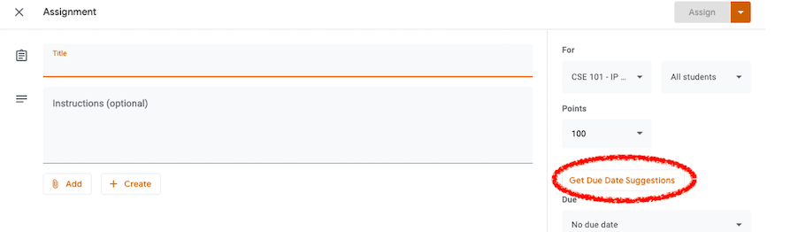
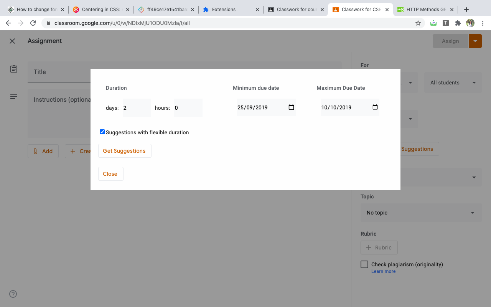
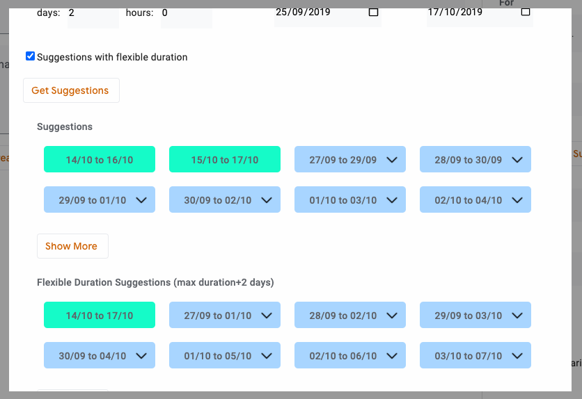
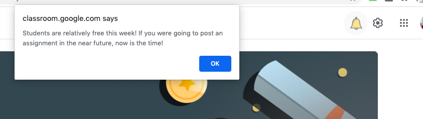
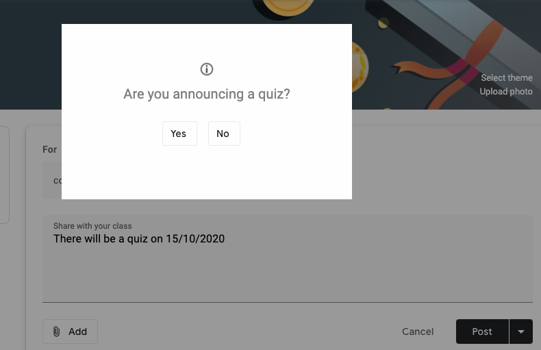
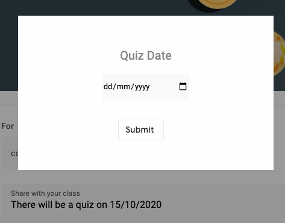

# google-classroom-extension

## Features
* Suggests due dates while posting an assignment by considering the work load on students from other courses as well.
* Informs the professor through a bell icon when the students are relatively free so that the professor can give assignments at the right time.
* Detects quiz announcements and asks the professor if the announcement posted was announcing an upcoming quiz so that this quiz can be taken into account while suggesting deadlines for other courses.

## Help
### Scheduling assignments
#### Click on Get Due Date Suggestions

#### Enter duration, minimum due date, maximum due date and click on Get Suggestions

#### View suggestions in sorted order. Click on dropdown to view reason

### Bell Icon Alert
#### Click on the bell icon GIF to view notification from this extension

### Quiz detection
#### On posting an announcement, you might be prompted to confirm if this announcement was about an upcoming quiz. 

#### If it is, please enter the date of the quiz so that this quiz can be taken into account while suggesting assignment deadlines

