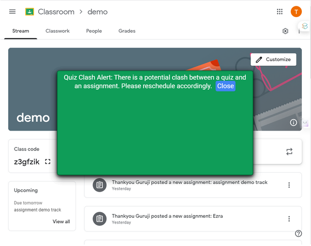
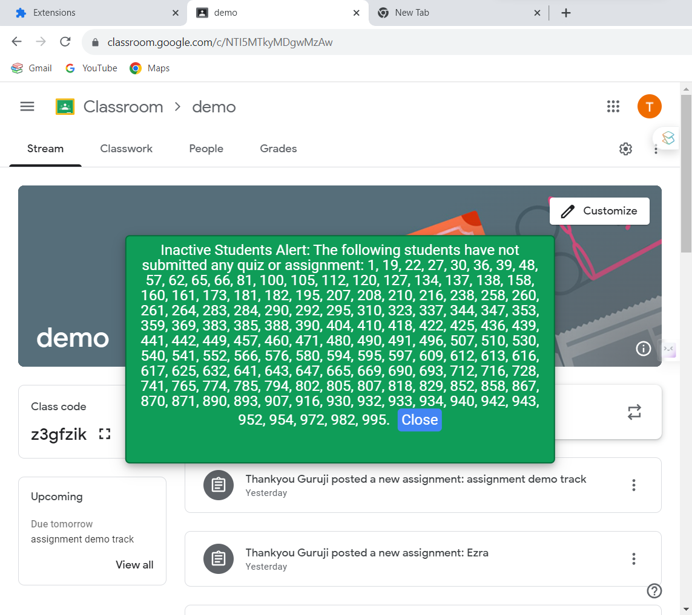
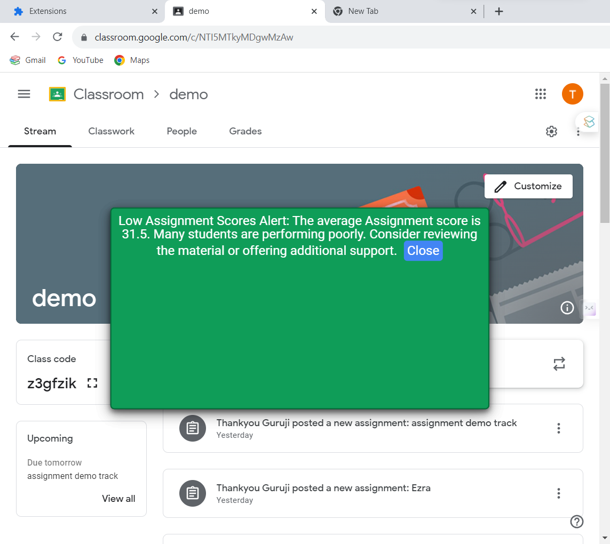

# easy-scheduler-extension

## Features

- Suggests due dates while posting an assignment by considering the work load on students from other courses as well.
- Informs the professor through a bell icon when the students are relatively free so that the professor can give assignments at the right time.
- Detects quiz announcements and asks the professor if the announcement posted was announcing an upcoming quiz so that this quiz can be taken into account while suggesting deadlines for other courses.

### New Features:

### Update 1: Avoid Quiz Clash With Assignment

- Implemented check in `quiz_detection.js` to avoid scheduling an assignment when there is a quiz/exam for the students according to the due date.
- Modified `quiz_detection.js`: (https://github.com/aniket19233-maker/easy-scheduler-extension/commit/edae33d92930a0771e392f510e470b81293f83fd)
- Added `informAboutQuiz(date)` function to send an API request, informing the system about upcoming quizzes.
- Introduced quiz clash alert for testing purposes.

### Update 2: Quiz Clash Alert

- Implemented alert system to notify the professor about potential clashes if a quiz is scheduled close to an assignment deadline.
- Created APIs for testing using mock datasets and schemas.
- Check the changes: (https://github.com/DakshSammi/easy-scheduler-extension/commit/a39272f4efc744feae8115430529dba969dad558)

### Updates 3 and 4: High and Low Assignment Completion Alerts

- Introduced alerts to notify the professor when the completion rate of an assignment reaches 70-80% (high completion) or falls below 20-40% (low completion).
- Implemented `calculateAssignmentCompletionRate` function to compute completion rates based on submission data.
- Check the changes: (https://github.com/DakshSammi/easy-scheduler-extension/commit/30360a3ffd664496e4d47b8ea6ecc74adb50d45c)
- Alerts displayed for high and low completion rates.

### Update 5: Extended Completion Rate Checking to Quizzes

- Extended functionality to check completion rates (low < 30% or high > 70%) for quizzes as well.
- Introduced `calculateQuizCompletionRate` function.
- Check the changes: (https://github.com/DakshSammi/easy-scheduler-extension/commit/0f5ae646e0808be2f5ec90e154c88e7f46d7d37c)
- Alerts for quizzes based on completion rates.

### Update 7: Inactivity Alert

- Implemented feature to notify the instructor if a student has been inactive in the course for a specified duration.
- Introduced `checkForStudentInactivity` function.
- Check the changes: (https://github.com/DakshSammi/easy-scheduler-extension/commit/b459306dd78f934a7b20775f06c495d1af80dc50)
- Alerts for inactive students, prompting timely intervention.

### Update 8: Low Quiz/Assignment Scores

- Implemented alert system to notify the instructor if many students perform poorly on a quiz or assignment.
- Introduced `calculateAverageScore` and `checkLowScores` functions.
- Check the changes: (https://github.com/aniket19233-maker/easy-scheduler-extension/commit/349bd649bf78034f4841c4f494613c4b1b9e822a)
- Alerts for low scores, suggesting potential actions for improvement.

## Classroom Help

### Scheduling assignments

#### Click on Get Due Date Suggestions

#### Enter duration, minimum due date, maximum due date and click on Get Suggestions

#### View suggestions in sorted order. Click on dropdown to view reason

### Bell Icon Alert

#### Click on the bell icon GIF to view notification from this extension

### Quiz detection

#### On posting an announcement, you might be prompted to confirm if this announcement was about an upcoming quiz.

#### If it is, please enter the date of the quiz so that this quiz can be taken into account while suggesting assignment deadlines

### New Features

#### Quiz Clash Alert

- Professors are alerted about potential quiz clash when scheduling assignments or quizzes.
  

#### High and Low Assignment Completion Alerts

- Professors receive alerts when assignment completion rates are high or low.
  

#### High and Low Quiz Completion Alerts

- Professors receive alerts when assignment completion rates are high or low.
  

#### Inactivity Alert

- Instructors are notified about student inactivity in the course, allowing timely intervention.
  

#### Low Quiz/Assignment Scores Alert

- Alerts for low scores trigger professors to review material or offer additional support.
  

## Backpack Help

### Scheduling Assignments

#### Click on optimally scheduled to use the feature

#### Enter duration, minimum due date, maximum due date and click on Get Suggestions

#### View suggestions in sorted order. Hover over learn more to view reason

#### Set reminder in case you want to schedule the assignment later

### Quiz detection

#### Enable automatic tagging feature to automatically detect quiz/exam announcement and its date

